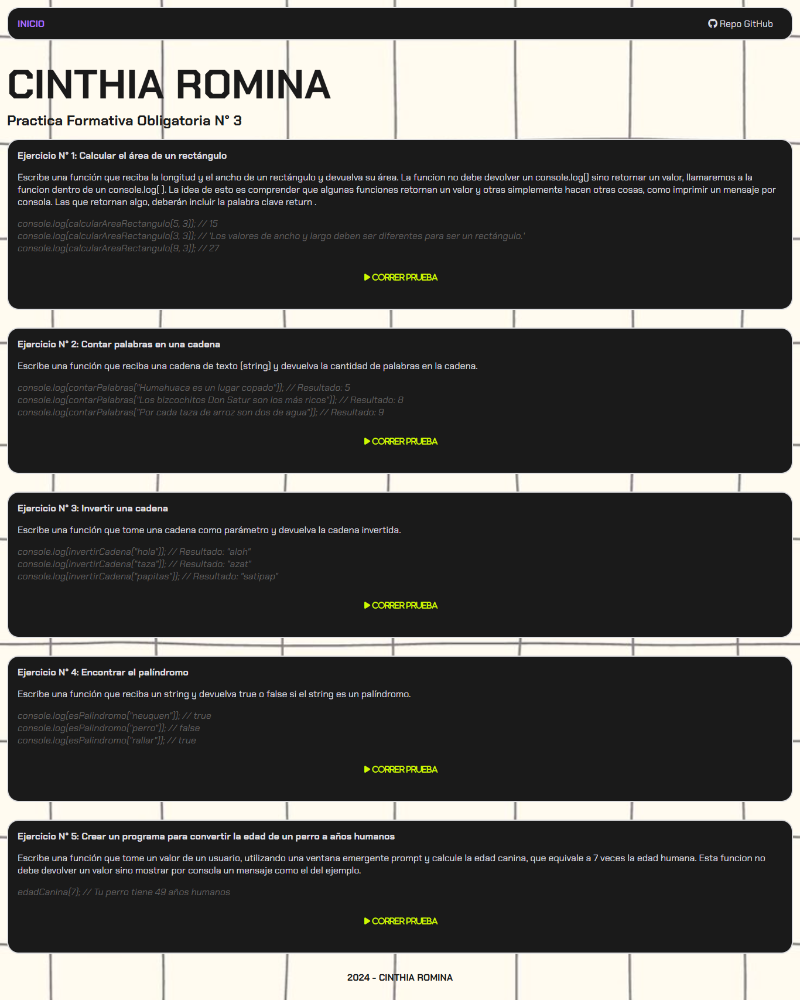

# 📌 Práctica Formativa Obligatoria N° 3 (PFO 3)

Este proyecto es una práctica formativa que incluye ejercicios de programación utilizando HTML, CSS y JavaScript para resolver problemas de lógica.

---

## 📋 Contenido del Proyecto

### Ejercicios incluidos:

1. **Calcular el área de un rectángulo**  
   Escribe una función que reciba la longitud y el ancho de un rectángulo y devuelva su área.  

   ```javascript
   console.log(calcularAreaRectangulo(5, 3)); // 15
   ```

2. **Contar palabras en una cadena**  
   Escribe una función que reciba una cadena de texto y devuelva la cantidad de palabras en ella.  

   ```javascript
   console.log(contarPalabras("Humahuaca es un lugar copado")); // Resultado: 5
   ```

3. **Invertir una cadena**  
   Escribe una función que reciba una cadena y devuelva la cadena invertida.  

   ```javascript
   console.log(invertirCadena("hola")); // Resultado: "aloh"
   ```

4. **Determinar si un string es un palíndromo**  
   Escribe una función que determine si una cadena es un palíndromo (se lee igual de adelante hacia atrás).  

   ```javascript
   console.log(esPalindromo("neuquen")); // true
   ```

5. **Convertir la edad de un perro a años humanos**  
   Escribe una función que calcule la edad de un perro en años humanos, considerando que cada año canino equivale a 7 años humanos.  

   ```javascript
   edadCanina(); // Prompt para ingresar la edad del perro
   ```

---

## 🖼️ Captura de Pantalla



---

## 📂 Estructura del Proyecto

```
PFO3/
├── global.css               # Estilos globales para el proyecto
├── index.html               # Página principal con los ejercicios
├── main.js                  # Archivo con las funciones JavaScript
├── Practica Formativa Obligatoria 3.pdf  # Documento proporcionad por la cátedra
├── style.css                # Estilos personalizados
└── screencapture.png        # Captura de pantalla del proyecto
```

---

## 🚀 Deploy del Proyecto

El proyecto está disponible en el siguiente enlace:

👉 **[Abrir Proyecto](https://tsds-front-end-pfo-3.vercel.app/)** 👈

---